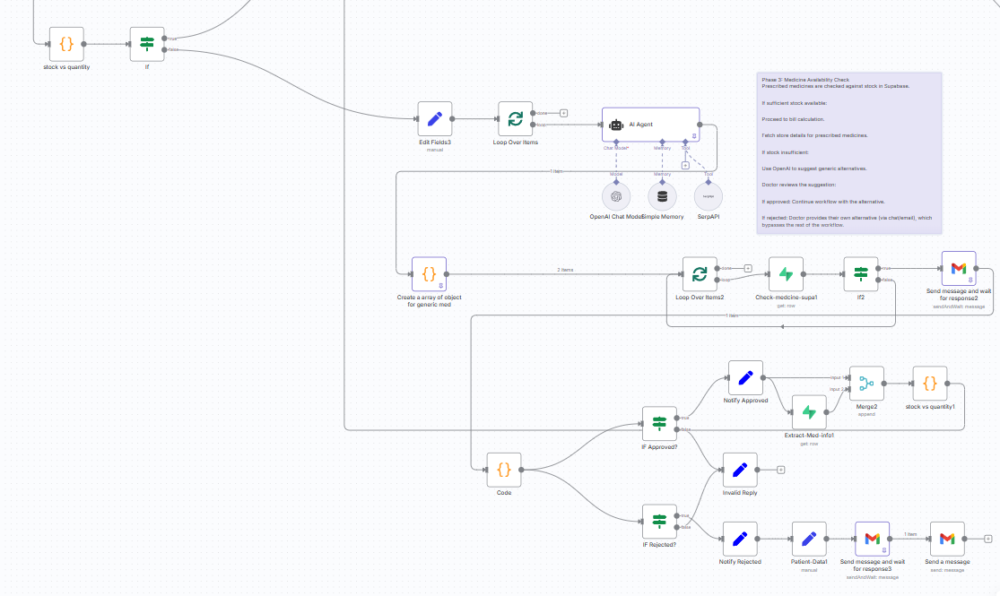

Perfect 👍 Here’s your **updated GitHub README** for **PharmaPilot**, now including **screenshots for Phase 1–2, 3–4, and 5–6**, neatly embedded with captions and aligned to look professional on your repo page 👇

---

````markdown
# 💊 PharmaPilot  

**PharmaPilot** is an intelligent **pharmacy automation system** built using [n8n](https://n8n.io/) and **MySQL**, designed to streamline patient visits, prescriptions, billing, and delivery management.  
It ensures **smarter, faster, and automated healthcare workflows** — all without writing a single line of code.

---

## ⚙️ Features  

- 🧑‍⚕️ **Patient Management** – Simplified registration and visit tracking  
- 💊 **Medicine Automation** – Real-time stock updates and automatic alternative substitution  
- 🧾 **Dynamic Billing** – Auto-calculates invoices with live inventory sync  
- 🚚 **Smart Delivery Assignment** – Assigns agents based on rating, pincode, and workload  
- 📬 **Email Webhooks** – Sends real-time updates to patients and delivery agents via one-click status links  

---

## 🧠 Tech Stack  

| Component | Description |
|------------|-------------|
| **n8n** | Visual workflow automation platform |
| **MySQL** | Backend database for patients, medicines, and agents |
| **Gmail API & Webhooks** | For interactive communication and live tracking |
| **.env Configuration** | Stores MySQL credentials, API keys, and email settings |

---

## 🚀 Getting Started  

### 1️⃣ Clone the Repository  
```bash
git clone https://github.com/JatinBandekar/PharmaPilot.git
cd PharmaPilot
````

### 2️⃣ Set Up the Database

* Import the SQL schema:

  ```bash
  mysql -u your_user -p your_database < schema/pharma_pilot.sql
  ```

### 3️⃣ Import Workflows

* Open [n8n](https://n8n.io/) → **Settings → Import Workflows**
* Select the workflows from the `/workflows` folder in this repository.

### 4️⃣ Configure Environment

* Create a `.env` file and add your details:

  ```bash
  MYSQL_HOST=localhost
  MYSQL_USER=root
  MYSQL_PASSWORD=your_password
  MYSQL_DATABASE=pharma_pilot
  GMAIL_API_KEY=your_gmail_api_key
  ```

---

## 📊 Workflow Highlights

✅ **Automated Invoicing** – Generates bills instantly after prescription creation
🔄 **Inventory Sync** – Updates stock in real-time when medicines are assigned
🚚 **Smart Routing** – Assigns delivery agents by pincode and workload optimization
💌 **Email Notifications** – Sends interactive status updates via Gmail API

---

## 🧩 Workflow Snapshots

### 🩺 Phase 1 & 2 – Input Handling and Patient Verification


---

### 💊 Phase 3 & 4 – Medicine Availability and Billing



---

### 🚚 Phase 5 & 6 – Delivery & Inventory Update


---

## 🩺 Purpose

**PharmaPilot** bridges the gap between **healthcare and automation**.
It empowers pharmacies to:

* Reduce manual workload
* Prevent stock and billing errors
* Improve delivery efficiency

—all through a **no-code, connected ecosystem** powered by n8n.

---

## 🪪 License

This project is open-source and available under the [MIT License](LICENSE).

---

## 🧑‍💻 Author

**Jatin Bandekar**
📧 [bandekarjatin02@gmail.com](mailto:bandekarjatin02@gmail.com)
🔗 [GitHub Profile](https://github.com/jatinAB)

---

## ⭐ Acknowledgment

If you found **PharmaPilot** useful, consider giving it a ⭐ on [GitHub](https://github.com/jatinAB/PharmaPilot) —
your support helps promote smarter healthcare automation 🚀


Would you like me to also add a **small “System Architecture Diagram”** section before the snapshots (for extra visual appeal)? It looks great for project documentation.
